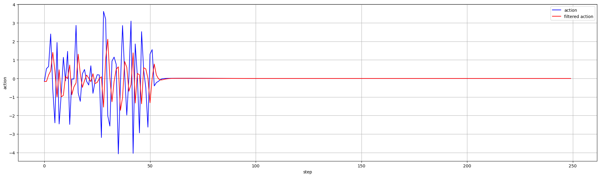
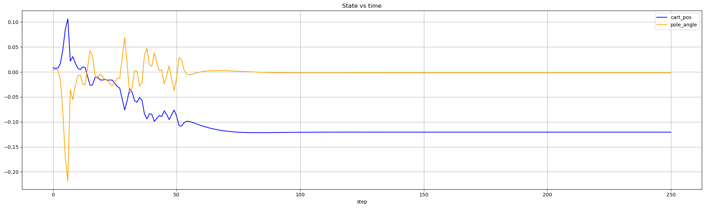
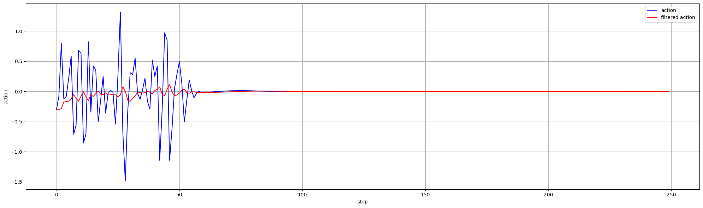
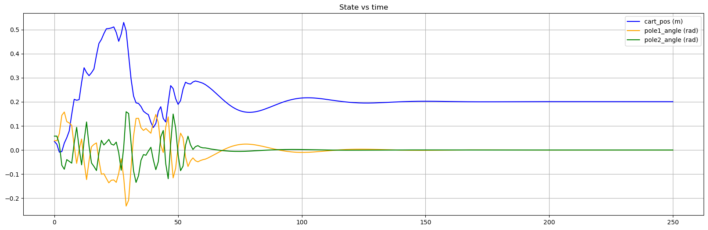
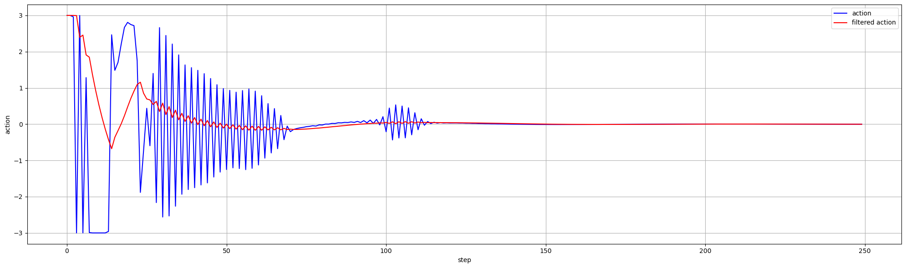
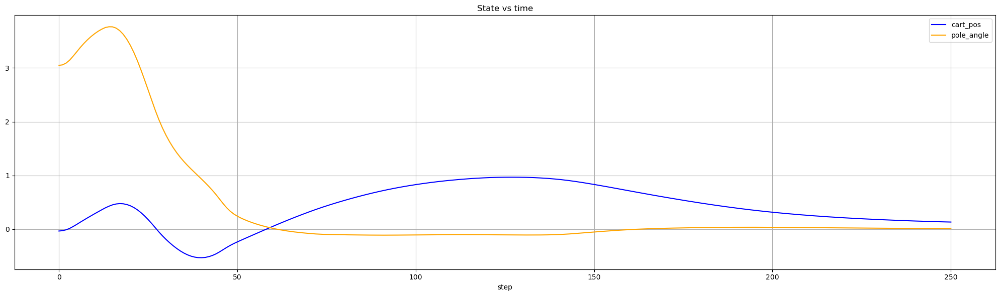
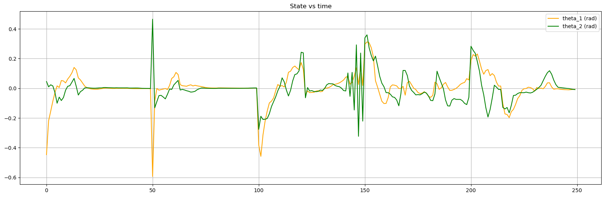
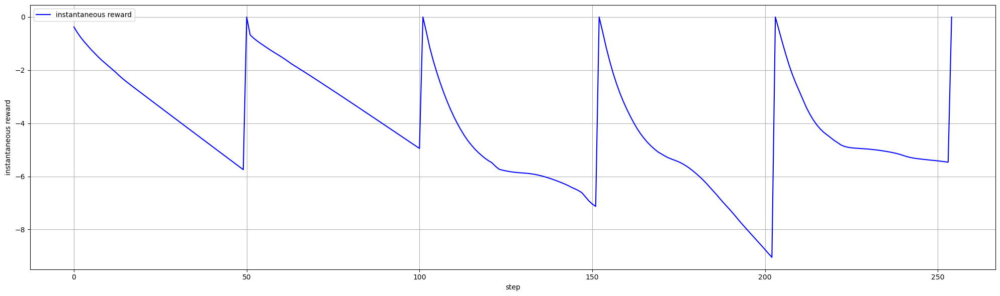

# DRL experiment
This set of experiments explores the fundamental concepts in RL and DRL, as well as their applications in various simulated environments. Throughout the making this repo, I learned the theory of RL and DRL from the [RL Course by David Silver](https://www.youtube.com/watch?v=2pWv7GOvuf0&list=PLqYmG7hTraZDM-OYHWgPebj2MfCFzFObQ&index=1) and Sutton & Barto's RL book ([Reinforcement Learning: An Introduction, 2018](https://www.andrew.cmu.edu/course/10-703/textbook/BartoSutton.pdf))

## Demos
Demo video                                                                          | Plot of states, action, and reward
:-----------------------------------------------------------------------------------|:-------------------------
Inverted pendulum using custom TD3 with added initial noise $\varepsilon \sim \mathbb{N}((0,1))$ in the first 50 time steps    |   Plot of the cart action with injected noise in the first 50 steps  <br><br> Plot of the pendulum states (cart position in blue, and pendulum angle in yellow) 
Inverted double pendulum using custom TD3 with added initial noise $\varepsilon \sim \mathbb{N}((0,1))$ in the first 50 time steps  |   Plot of the cart action with injected noise in the first 50 steps  <br><br> Plot of the pendulum states (cart position in blue, and pendulum angle in yellow and green) 
Swing-up inverted pendulum using custom TD3  | Plot of the cart action  <br><br> Plot of the pendulum states (cart position in blue, and pendulum angle in yellow) 
Reacher using custom TD3  | Plot of the actions across 5 episodes in the video  <br><br> Plot of the reward achieved in each episode 
HalfCheetah training using custom-made TD3 algorithm to learn an effective running gait | I plan to put the reward plot here, but the reward is highly dependent on the frame_skip argument. This is the default to 5 during training, but I decreased it to 1 for demo purposes, thus lowering the result received
Walker2D using custom-made TD3 algorithm to learn an effective bipedal walking gait 


## Project Structure
The structure is listed in the order of development to represent my roadmap for learning RL and DRL 
```txt
.
├── 📂 gym_exercise/: contains experiments with RL and DRL experiments in various gymnasium environments, such as FrozenLake-v1, CartPole-v1, InvertedPendulum-v5,...
│   │   
│   ├── 📂 FrozenLake/: This environment serves as a learning and testing ground for both traditional RL and DRL algorithms.
│   │   │               The algorithms that I tested in this environment include both value-based (Monte Carlo and
│   │   │               Temporal Difference with SARSA and Q-learning updates) and policy-based approaches (REINFORCE when is_slipper=False)
│   │   ├── 📄 custom_frozenlake_2.py
│   │   ├── 📄 custom_frozenlake.py
│   │   ├── 📄 frozen_lake_plot.py: contains a function to draw a simplified version of 4x4 FrozenLake using matplotlib
│   │   │                           to show state-action value and visualize the epsilon-greedy policy arrow
│   │   └── 📄 frozen_lake.ipynb: the main notebook with the code for training the RL algorithms
│   │   
│   ├── 📂 CartPole/: An environment with a continuous observation space (states are bounded real values) and a discrete
│   │   │             action space. Therefore, I used this environment to reinforce my knowledge of value function 
│   │   │             approximation using neural network approximations. Each algorithm tested (listed below) was trained 
│   │   │             using one starting hyperparameter set. They are then trained in a grid search to investigate the 
│   │   │             effect of each hyperparameter on the training performance. The algorithms that I trained in the
│   │   │             `CartPole-v1` environment are:
│   │   ├── 📂 cartpole_DQN_results/: contains the results from different Deep Q-Network training runs
│   │   │   ├── 📂 run_[xxxxx]: the folder of each run consists of a param_config.json file with the hyperparameters and
│   │   │   │                   validation/test results, the saved model (.pth), and the training history (.png)
│   │   │   └── 📄 trial_to_param.json: contains the mapped list of corresponding run_[xxxxxx] to parameter configuration in the
│   │   │                               following format
│   │   │                               [YYMMDD]_[HHMM]_[model_id]_[lr]_[buf_size]_[tar_update_freq]_[gamma]_[eps_decay]_[batch_size]
│   │   ├── 📂 cartpole_DDQN_results/: contains the results from different Double DQN training runs
│   │   │   ├── 📂 run_[xxxxx]: same as DQN
│   │   │   └── 📄 trial_to_param.json: same as DQN
│   │   ├── 📂 cartpole_REINFORCE_results/: contains the results from different REINFORCE training runs with and without baseline
│   │   │   ├── 📂 run_[xxxxx]: same as DQN
│   │   │   └── 📄 trial_to_param.json: contains the list of corresponding run_[xxxxxx] to parameter configuration in the
│   │   │                               following format
│   │   │                               [YYMMDD]_[HHMM]_REINFORCE[_baseline]_OOP_nCUDA_[model_id]_[alpha][_beta if baseline]_[gamma]
│   │   ├── 📂 cartpole_AC_results/: contains the results from different A2C training runs
│   │   │   ├── 📂 run_[xxxxx]: same as DQN
│   │   │   └── 📄 trial_to_param.json: contains the list of corresponding run_[xxxxxx] to parameter configuration in the
│   │   │                               following format [YYMMDD]_[HHMM]_AC_OOP_nCUDA_[model_id]_[actor_lr]_[critic_lr]_[gamma]
│   │   ├── 📄 cartpole.ipynb - Python script for experimenting with the algorithms individually before running a grid search
│   │   ├── 📄 cartpole_grid.ipynb - Python script to run a hyperparameter grid search for each algorithm
│   │   └── 📄 cartpole_grid_ddqn.ipynb (deprecated) - first script to run a hyperparameter grid search for DDQN
│   │   
│   ├── 📂 InvertedPendulum/: application of PPO and TD3 training in the gymnasium InvertedPendulum-v5 environment and
│   │   │                     a customized SwingUp Inverted Pendulum environment I created with a wrapper
│   │   ├── 📂 SwingUp/: a custom wrapper and a modified MuJoCo environment that I created to train DRL agents for
│   │   │                the swing-up invpen problem
│   │   ├── 📂 invpend_PPO_results/: contains the results from different PPO training runs from the hyperparameter grid search
│   │   ├── 📂 invpend_TD3_results/: contains the resulting TD3 agents trained during hyperparameter grid search
│   │   ├── 📂 swingup_TD3_results/: contains the resulting TD3 agents in the swing-up inverted pendulum problem
│   │   ├── 📄 inv_pend.ipynb - the main Python script for testing individual algorithms before running a grid search
│   │   ├── 📄 invpend_test.ipynb - script to test the resulting policies while policies are trained automatically
│   │   └── 📄 invpend_test.ipynb - script to test the resulting DRL policies in the swing-up inverted pendulum problem
│   │
│   ├── 📂 InvertedDoublePendulum/:
│   │
│   ├── 📂 Reacher/: a gymnasium environment with a 2-DOF planar manipulator, whose goal is to move its end effector
│   │                toward a random goal point within its workspace
│   │   ├── 📂 reacher_TD3_results/: contains the resulting 
│   │   ├── 📄 reacher.ipynb - script to train TD3 agents in the gymnasium Reacher-v5 environment
│   │   └── 📄 reacher.ipynb
│   │
│   ├── 📂 HalfCheetah/:
│   │   ├── 📂 halfcheetah_TD3_results/:
│   │   ├── 📄 halfcheetah.ipynb - script to train TD3 agents in the gymnasium HalfCheetah-v5 environment
│   │   └── 📄 halfcheetah_test.ipynb
│   │
│   └── 📄 algos.py - common Python algorithm file with custom class definition for Actor(), Critic() and the TD3() algorithm
│                     I created this file since I might have to reuse the custom-made TD3 algorithm across different environments
└── 📂 stable_baselines3/: 
```

## Requirements
Setup a virtual environment (venv) and install the following dependencies in the venv
'pip install gymnasium'

Installing pytorch (with or without CUDA) - [PyTorch documentation](https://pytorch.org/get-started/locally/)
